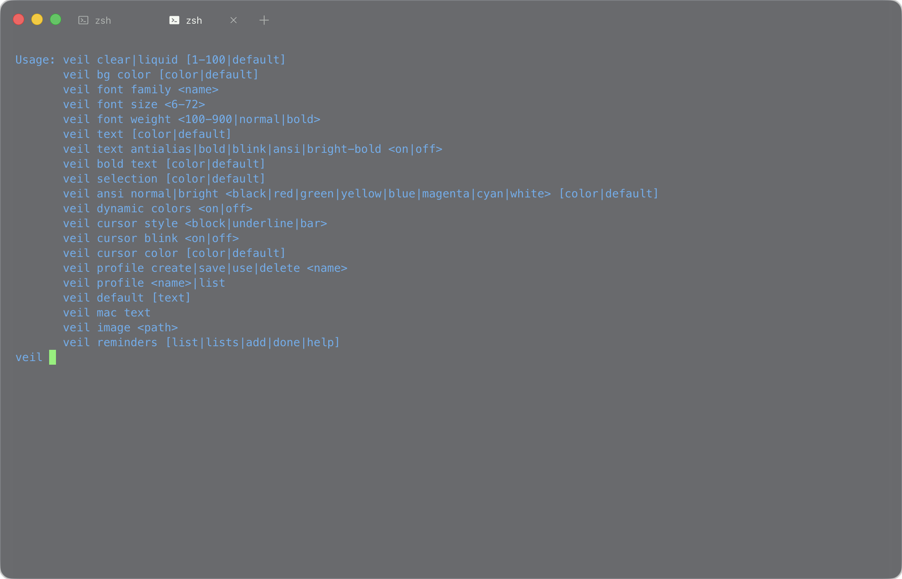

# Veil Terminal

[Download the DMG from Releases](https://github.com/roxvihaan/Veil/releases)

A minimal macOS terminal with real desktop transparency, blurred Liquid mode, live config commands, tabs, splits, color ASCII images and GIF playback. An optional Neofetch extension remembers a custom image as your default logo.

Veil uses an Electron macOS window, xterm.js and real pseudo-terminal sessions. It is a terminal emulator, not a simulated command prompt.



## Coming soon

CLI — coming soon.

## Installation

### Download the DMG

Open [Releases](https://github.com/roxvihaan/Veil/releases) and download the `.dmg` under **Assets** for the version you want.

Download [Veil 0.1.2 for Apple Silicon](https://github.com/roxvihaan/Veil/releases/download/v0.1.2/Veil-0.1.2-arm64.dmg). It opens a large installer window with two big icons, an arrow, and **Drag Veil to Applications** instructions. Drag the Veil icon onto the Applications folder, eject the disk image, then launch Veil from Applications. No Node.js, npm or compiler is needed for the downloaded app.

This release is **Apple Silicon only** (M1 or newer), targets macOS 12 or newer, and has been tested on macOS 26.5.1. Intel is not included. The [release page](https://github.com/roxvihaan/Veil/releases/tag/v0.1.2) also includes a SHA-256 checksum file.

**First-launch security:** this release is ad-hoc signed, not Developer ID notarized. macOS may block the initial launch. Only if you trust this source, follow [Apple's instructions for approving an unnotarized app](https://support.apple.com/en-us/102445) in System Settings → Privacy & Security → Open Anyway after attempting to open it. Do not disable Gatekeeper or remove quarantine globally. This distribution does not change your security settings.

### Install with Homebrew

```sh
brew install --cask roxvihaan/tap/veil
```

This uses the project's [personal Homebrew tap](https://github.com/roxvihaan/homebrew-tap), not the main `homebrew/cask` catalog. It installs the same Apple Silicon DMG and links the `veil` command into Homebrew's bin directory. Homebrew verifies the pinned download checksum. Approve only this cask if Homebrew asks you to trust it; whole-tap trust is unnecessary. The first-launch security note above still applies.

To update or uninstall:

```sh
brew update
brew upgrade --cask roxvihaan/tap/veil
brew uninstall --cask roxvihaan/tap/veil
```

Save your terminal work and quit Veil before upgrading or uninstalling. Normal uninstall preserves `~/.config/veil/config`. If you already installed Veil manually, do not use `--force` to overwrite it blindly; quit it and move that copy aside before installing with Homebrew.

### Build from this repository

Requirements: macOS, **Node.js 22.12 or newer**, npm, Git and Xcode Command Line Tools. Run `xcode-select --install` if the command-line tools are not installed. Apple Silicon is the tested architecture; Intel builds have not been verified.

```sh
git clone https://github.com/roxvihaan/Veil.git
cd Veil
npm ci
npm run package:mac
```

The first install/build downloads Electron and matching native headers, so it needs an internet connection. Packaging compiles the blur and image modules, bundles the terminal, applies the current sizing/lifecycle patch, and ad-hoc signs and verifies the app. It creates `release/Veil Terminal.app`; it does not modify an installed copy in Applications.

### Install the app bundle

The generated app is `release/Veil Terminal.app`. The build tested for this upload is **Apple Silicon / arm64**, not a universal Intel build. Its bundle declares macOS 12.0 as the minimum; the current implementation has been exercised locally on macOS 26.5.1. Blur behavior on other macOS versions is not guaranteed.

1. Build the app using the commands above, or download the DMG linked above. A source-only checkout is not an installable application.
2. Drag the app into **Applications**.
3. Open **Veil Terminal** from Finder or Launchpad.
4. In Veil, try `veil liquid`, `veil clear 100` or `veil mac text`.

The local build is ad-hoc signed, not Developer ID notarized. macOS may ask you to approve opening it; review the source and origin before approving. Do not disable Gatekeeper system-wide.

If replacing an existing installation, save your work and quit Veil first. Configuration lives outside the app bundle and is retained when you replace the app. A restart is needed for application-code updates; ordinary config edits reload live.

### Use the Veil command from another terminal

Inside Veil, its bundled `bin` directory is already on `PATH`. To expose the same command in another shell, add this to that shell's startup file, adjusting the app path if necessary:

```sh
export PATH="/Applications/Veil Terminal.app/Contents/Resources/app/bin:$HOME/.local/bin:$PATH"
```

The `veil` command changes appearance or renders images. It is not the application launcher; use `open -a "Veil Terminal"` to launch the app.

### Optional: install the Neofetch image extension

This extension requires an existing **Neofetch** installation; it does not install or replace the underlying program. It has been tested with Neofetch 7.1.0.

From a checkout containing `Neofetch/neofetch`, with Veil installed in Applications:

```sh
mkdir -p "$HOME/.local/bin" "$HOME/.local/libexec/veil"
install -m 755 Neofetch/neofetch "$HOME/.local/bin/neofetch"
install -m 755 "/Applications/Veil Terminal.app/Contents/Resources/app/bin/veil-image" \
  "$HOME/.local/libexec/veil/veil-image"
```

Back up an existing `~/.local/bin/neofetch` before replacing it. The wrapper defaults to calling `/usr/local/bin/neofetch` and leaves that file unchanged. If your real Neofetch is elsewhere, set its absolute path in your shell startup file, for example:

```sh
export NEOFETCH_REAL="/opt/homebrew/bin/neofetch"
```

Do not point `NEOFETCH_REAL` at the wrapper itself. Ensure `~/.local/bin` precedes the real Neofetch directory on `PATH`. Veil adds it automatically. In an already-open zsh session, run `rehash` once after installation.

## Features and everyday use

### PiP docking and draggable ASCII panes

- `veil pip bound` or `veil pip`: fit PiP to the split, preserving the current linked sizing behavior.
- `veil pip unbound`: follow the split's center while keeping PiP at its own size. Resize it independently; it can extend outside the split. Neither window forces the other's size. Detaching and restoring the terminal work the same in both modes.

Run `veil pip` in the split you want to use. This clears that split's view and parks its existing terminal without closing the shell or creating another split. Select your PiP from the app/window list and it docks directly—no extra drag required. **Return to terminal** restores the original session and scrollback. Veil links the real external window to the split without capturing video or changing playback. PiP no longer appears in the right-click menu. Discovery is app-independent: any PiP exposing movable/resizable windows through macOS Accessibility can be selected. Apps that do not expose those controls cannot be docked.

The native `veil-pip` helper needs macOS **Accessibility** permission. If access is missing, use **Allow Accessibility / retry**, enable `veil-pip` (or Veil Terminal) in System Settings → Privacy & Security → Accessibility, and reconnect. Only the explicitly selected window is controlled. The picker includes ordinary windows because some apps leave PiP titles blank; check the app, title and dimensions before selecting. No screen-recording permission is needed.

If Accessibility is already enabled but Veil still reports denial after an update, remove the old Veil entry and add the exact app you are running again. Older development builds used a changing signing hash, invalidating saved grants while leaving the toggle enabled. Current local builds use stable app and helper signing identities; migrating from an old grant still needs one manual reauthorization. The app does not reset or bypass system permissions.

Moving Veil or resizing a split updates the linked PiP. Resizing the PiP adjusts the nearest split on each axis, within the layout's minimum sizes. Its aspect ratio is preserved, so some pane space may remain unused. Drag the PiP away to detach; Escape cancels tracking of the current dock/drag. Closing its pane, switching away from its tab, hiding/minimizing Veil, or closing the PiP releases the link without closing its source app. Only one external PiP can be linked at a time.

For ASCII, drop one image or GIF file onto a terminal at an empty shell prompt. Veil runs `veil image '<path>'` automatically, with the path safely quoted. Drops are rejected if text is already typed or a different foreground program is running; after complex history/editing, submit or cancel the line first. The image action no longer appears in the right-click menu. You can still type `veil image <path>` normally.

After a successful file drop, hover over that pane and use **Move image / GIF** to float it. Drag the small header into a cleared PiP split or leave it floating within Veil. Drag its bottom-right corner to resize; **Return to split** or Escape returns it to its original pane. This moves the *whole terminal pane* containing the ASCII, retaining its PTY, scrollback and GIF state—not individual characters or a screenshot. Floating media is hidden when its tab is inactive.

External PiP support is experimental: automated docking/layout/session tests pass and live Dia PiP discovery/selection was checked, but end-to-end native dragging, sizing constraints and multi-display behavior still need verification. Dia retains control of its native drag; Veil previews during dragging and animates into place after release rather than fighting the source app by moving the window under the pointer. Edge-created splits are not supported; create an empty split first. These features require a new local build; existing release DMGs are unchanged. See [implementation and tuning](docs/pip-docking.md).

### Apple Reminders

Veil connects to Apple Reminders through macOS EventKit. Run:

```sh
veil reminders
veil reminders lists
veil reminders list "Personal"
veil reminders add "Buy coffee" "Personal"
veil reminders add "Buy coffee" --notes "Whole beans, medium roast"
veil reminders add "Buy coffee" "Personal" --notes "Whole beans, medium roast"
veil reminders done <full-ID-from-the-list>
veil reminders help
```

The first data command requests macOS Reminders permission. `help` never requests access. The default view shows incomplete reminders across lists; `add` without a list uses your default Reminders list. Use a list ID when names are duplicated. `done` requires an exact reminder ID and is safe to repeat. Changes are saved to Apple Reminders; account syncing is handled by macOS.

Access is requested only when you run a Reminders command. If denied, enable it under System Settings → Privacy & Security → Reminders for Veil or the terminal launching the command. The native helper includes its own permission description for use outside Veil. These commands require a build containing the helper; older published installers do not include it.

Maintainers can compile the helper with `node scripts/build-veil-reminders.mjs`; normal macOS packaging bundles it automatically.

### Messages contacts

Find a saved phone number or email without leaving Veil:

```sh
veil messages contacts                         # first 20 contacts
veil messages contacts list 50
veil messages contacts search 'Alex'
veil messages contacts search 'example.com' 50
veil messages contacts search '5551234'
veil messages contacts help
```

Results show names and labeled phone numbers and emails. Search ignores case and accents; phone searches also ignore common phone punctuation. Lists follow your macOS Contacts sort order. Limits are 1–200, and Veil tells you when more matches exist. Searches cover only the contacts macOS makes available to Veil.

The first data command requests **Contacts** permission. If denied, enable Veil (or the launching terminal) in System Settings → Privacy & Security → Contacts. Full Disk Access is not required. Help and invalid commands never request access. Commands are read-only and do not send messages or change contacts.

To message someone, copy the desired number or email into `veil messages send`; use a phone number with country code and no spaces or punctuation except the leading `+`. Contact names are not automatically resolved by the send command, so you choose the intended recipient when there are multiple matches.

Normal packaging bundles the helper. For development use `node scripts/build-veil-contacts.mjs`. Older published installers do not include this integration.

### Messages

Use the Messages account already signed in on your Mac. Contact lookup is available under `veil messages contacts`; `veil imessage` and the standalone `veil contacts` remain compatibility aliases.

Commands:

```sh
veil messages                 # latest 20 local iMessage chats and their IDs
veil messages chats 50
veil messages read 123        # latest 20 messages for chat ID 123, oldest first
veil messages read 123 50
veil messages send '+15555550123' 'On my way'
veil messages send 'friend@example.com' 'Hello!'
veil messages help
```

Saved contact names appear in chat lists, incoming-message sender labels, unnamed group participants, and send confirmations. Named groups retain their titles and your own messages remain labeled `You`. macOS Contacts handles phone/email matching; unknown, unnamed, ambiguous, or inaccessible contacts fall back to the original address. The first Messages data command may ask for **Contacts** permission; denying it leaves messaging available with addresses. Display names never change the recipient used for sending or rewrite message text.

`send` submits immediately through Apple Messages, using an enabled iMessage account. It accepts a phone number (prefer international format) or email address, not a chat ID or contact name. Submission does not confirm delivery; check Messages before retrying an uncertain result. SMS/RCS, group sending, attachments, and live watching are not supported.

For reading, grant the launching app (Veil or your other terminal) **Full Disk Access** in System Settings → Privacy & Security. Sending separately requests **Automation → Messages** access. Veil does not change these permissions. Help and invalid commands access neither Messages nor its database. See [Apple’s explanation of macOS data-access controls](https://support.apple.com/guide/security/controlling-app-access-to-files-secddd1d86a6/web).

History is read locally from `~/Library/Messages/chat.db` in read-only mode and includes only iMessage chats synced to this Mac. Limits are 1–200. Rich messages whose text is stored only in an attributed body, attachments, and other non-text records show a placeholder directing you to Messages; they are not decoded. Chat IDs are local to this Mac. Message content is stripped of terminal control characters before display. The database schema is an internal macOS format and may change.

Normal packaging builds and bundles the native helper; for development use `node scripts/build-veil-imessage.mjs`. Older published installers do not contain this integration.

### Spotify

Control the Spotify desktop app locally from Veil:

```sh
veil spotify                  # playback state, volume, track, artist and album
veil spotify status
veil spotify play             # resume
veil spotify pause
veil spotify toggle
veil spotify next
veil spotify previous
veil spotify volume           # show Spotify's volume
veil spotify volume 40        # set Spotify's volume, 0–100
veil spotify help
```

Install the Spotify desktop app, open it and sign in first. These commands control that app on this Mac; they do not use the Spotify Web API, store credentials, or change system volume. Playback availability follows your Spotify account and current playback context. Track search, playlists, and remote device selection are not included.

The first valid command may request macOS **Automation → Spotify** permission for Veil or the terminal launching the command. If denied, enable it in System Settings → Privacy & Security → Automation. Help and invalid commands do not contact Spotify. Commands report when Spotify is closed instead of launching it automatically.

Normal packaging bundles the helper and its AppleScript. For development, run `node scripts/build-veil-spotify.mjs`. Older published installers do not contain this integration.

### Clear and Liquid glass

Veil shows the actual desktop and windows behind it. No wallpaper is bundled or simulated.

| Command | Effect |
| --- | --- |
| `veil clear 100` | Fully transparent background, without blur. |
| `veil clear 60` | 60% transparency with a darker background tint, without blur. |
| `veil liquid 100` | Transparent background with native behind-window blur. |
| `veil liquid 60` | The same blur plus a darker background tint. |
| `veil clear default` | Restore Clear's default: 100% transparency, no blur. |
| `veil liquid default` | Restore Liquid's default: 100% transparency and blur radius 28. |
| `veil default` | Restore every command-controlled appearance setting. |

Both modes accept whole numbers **1–100**. Higher values are more transparent; the Liquid percentage changes tint opacity, not blur strength. Omitting the value means `default`. The spelling `deafault` is also accepted wherever `default` is accepted. Decimals and the old `veil trans` command are not supported.

For a completely opaque window, set `transparent = false` in the config. A later `veil clear` or `veil liquid` command enables transparency again. `veil default` and `veil deafault` restore all appearance controls described below in one update; unrelated operational entries such as your shell and padding are preserved.

Liquid uses a small native module to blur behind the window. It relies on a private macOS window-server API; when that API is unavailable, Veil falls back to Electron vibrancy, which may have a different tint. This is Veil's blur mode, not a claim to implement Apple's system Liquid Glass material.

### Background tint color

```sh
veil liquid 60
veil bg color blue
veil bg color '#241a36'
veil bg color default
veil bg color deafault
```

`veil bg color <color>` changes the background tint visible through Clear/Liquid's opacity control. It accepts the same named colors and three- or six-digit hex colors as `veil text`. It preserves the current transparency, blur, text color and font. The tint applies once across the window, not separately to each split.

At **100% transparency** no tint is visible; lower the percentage (for example, `veil liquid 60` or `veil clear 60`) to see your color. This does not recolor the desktop or change the separate `transparent = false` opaque-window preset.

`veil bg color default`, `veil bg color deafault`, or simply `veil bg color` restores the original dark tint, `#14171c`. The setting persists in config as `glass-color`. `veil default` also resets it; text-only and Clear/Liquid defaults leave the selected tint unchanged.

### Text colors and font presets

```sh
veil text cyan
veil text '#a6e3a1'
veil text '#abc'
veil mac text
veil default text
```

- `veil text <color>` changes the default terminal foreground. Programs can still emit their own ANSI colors.
- Named colors: `black`, `white`, `red`, `green`/`lime`, `yellow`, `blue`, `magenta`/`purple`, `cyan`, `gray`/`grey`, `orange` and `pink`.
- Hex colors accept `#RGB` or `#RRGGBB`; quote the value so the shell treats it as an argument.
- `veil mac text` selects **SF Mono Regular, 11 pt**, and the default foreground.
- `veil default text`, `veil text default` and `veil deafault text` restore **JetBrains Mono, 14 pt, weight 450**, and foreground `#eef3ea`.
- Fonts must be available on your Mac; otherwise the configured fallback fonts are used.

Font and padding changes refit the terminal grid and update the shell's row/column count. The root pane fills the window instead of remaining at xterm's initial 24 rows.

### Command-only appearance controls

Veil has no settings panel and no background-image preference. All appearance controls are live `veil` commands:

| Setting | Command |
| --- | --- |
| Font family | `veil font family 'SF Mono'` |
| Font size | `veil font size 13` |
| Font weight | `veil font weight 500` |
| Antialias text | `veil text antialias on` / `off` |
| Use bold font faces | `veil text bold on` / `off` |
| Allow blinking text | `veil text blink on` / `off` |
| Display ANSI colors | `veil text ansi on` / `off` |
| Bright colors for bold ANSI text | `veil text bright-bold on` / `off` |
| Dynamic foreground colors (OSC 10) | `veil dynamic colors on` / `off` |
| Text color | `veil text cyan` |
| Bold text color | `veil bold text '#ffffff'` |
| Selection color | `veil selection '#5f745f88'` |
| Normal ANSI color | `veil ansi normal red '#ff5f57'` |
| Bright ANSI color | `veil ansi bright red '#ff6b63'` |
| Cursor shape | `veil cursor style block`, `underline` or `bar` |
| Cursor blink | `veil cursor blink on` / `off` |
| Cursor color | `veil cursor color '#79f26f'` |

Color commands accept the named colors above or hex. Selection also accepts `#RRGGBBAA` for translucency. Use `default` or the accepted `deafault` alias in any color command to restore that color. Disabling ANSI colors or blinking text affects newly received terminal output; it does not rewrite lines already in scrollback.

`veil default` is the full reset: Liquid at 100%, the original tint, JetBrains Mono 14/450, all normal and bright ANSI colors, text rendering switches, selection, and block cursor are restored together. `veil default text` remains the narrower original-text reset.

### Profiles

Profiles are named snapshots of the current config, stored locally under `~/.config/veil/profiles/`:

```sh
veil profile create work
veil profile create 1
veil profile work
veil profile use 1
veil profile save work
veil profile list
veil profile delete work
```

`create` refuses to overwrite an existing profile; `save` deliberately updates it. `veil profile <name>` is the short form of `veil profile use <name>`. Loading a profile replaces the active config in one write so open panes update together without being recreated.

### Tabs, splits and window controls

| Action | How |
| --- | --- |
| New terminal tab | Click `+` or press **⌘T**. |
| Switch tabs | Click a tab in the top bar. |
| Close a tab | Use its close control or **⌘W**; the current UI retains the final tab. |
| Split above | Right-click a pane → **Split above**. |
| Split below | Right-click a pane → **Split below**. |
| Split left/right | Right-click → **Split left** or **Split right**. |
| Close a split | Right-click → **Close split**. |
| Resize a split | Drag the divider; it snaps to equal sizes near the center. |
| Reset split sizes | Double-click the divider, or focus it and press **Enter**. Arrow keys resize it too. |
| Focus a pane | Click inside it. |
| Command palette | **⌘K**, then choose New tab, Open config or Focus terminal. |
| Open config | **⌘,**. |
| Move the window | Drag the title-bar area. |

The right-click menu creates independent split panes inside the current tab. Dividers are deliberately subtle. Creating a split retains the existing terminal, scrollback and running shell; only the new pane gets a new shell. Closing a pane ends that pane's session. Sessions are not restored after quitting the application.

### A real shell, not a command simulation

Veil runs the configured shell, falling back to the macOS account shell. zsh and bash start as interactive login shells in real PTYs. Each session gets `TERM=xterm-256color`, `COLORTERM=truecolor` and `TERM_PROGRAM=Veil`.

The initial `PATH` includes Veil's tools, `~/.local/bin`, common user-tool directories, Apple Silicon and Intel Homebrew locations, and the inherited environment. Installed tools such as `brew`, `git`, `vim` and `codex` are available even when Veil starts from Finder. Veil does not install those tools for you; shell startup files can also modify `PATH` afterward.

PTY output is batched for at most 4 ms at the IPC boundary, then passed to xterm's normal buffered write path. Large chunks flush without waiting for that timer. Geometry updates are event-driven rather than per-keystroke, avoiding extra work in the typing path. The included latency checks are regression checks, not a guarantee for every machine or workload.

### Open folders and files from macOS

```sh
open -a "Veil Terminal" "/absolute/path/to/project"
open -a "Veil Terminal" "/absolute/path/to/project/README.md"
open -a "Veil Terminal" --args --working-directory "/absolute/path/to/project"
open 'veil://open?path=/absolute/path/to/project'
```

- Opening a folder creates a terminal tab rooted in that folder.
- Opening a text, source-code or shell-script file creates a tab in its parent directory and opens the file in Vim. Quitting Vim returns to the login shell.
- The app registers folder/file handling and the `veil://` URL scheme with Launch Services. URL paths containing spaces or special characters should be percent-encoded.
- Registration does not force Veil into another app's hard-coded terminal picker. External applications must support selecting Veil or a custom launch command; no other application is modified or re-signed.

### Color ASCII images and animated GIFs

```sh
veil image "/absolute/path/to/image.png"
veil image "/absolute/path/to/icon.icns"
veil image "/absolute/path/to/animation.gif"
```

The bundled AppKit/Core Graphics decoder reads supported image formats, including PNG and native macOS `.icns`, without ImageMagick or a Homebrew dependency. It fits the image to the invoking pane, compensates for terminal character proportions, maps brightness to ASCII density, preserves orientation, leaves transparent pixels blank and uses 24-bit terminal color sequences with quantized channels.

Animated GIFs loop in the invoking pane's alternate screen. Press **Ctrl-C** to stop and return to the original screen. Put an animation in one split while working in another. Playback is capped at 20 FPS and colors are quantized to limit rendering work. When output is redirected or piped, an animated GIF emits a single frame instead of an endless animation.

### Persistent custom Neofetch art

After installing the optional wrapper:

```sh
neofetch image "/absolute/path/to/transparent-image.png"
neofetch
```

The first command converts the image, makes it the default logo and immediately runs Neofetch. Later ordinary `neofetch` calls reuse the saved art. Run `neofetch image` with another path to replace it.

Neofetch's version uses **six source-derived colors** mapped to its terminal palette, not the full 24-bit output of `veil image`. Color placeholders keep invisible ANSI sequences out of Neofetch's width calculation, so system information stays aligned. Transparent pixels become spaces. GIF input is saved as a static frame, not a persistent Neofetch animation.

The wrapper stores generated art at `~/.config/neofetch/veil-image-ascii.txt` and updates these settings in `~/.config/neofetch/config.conf`: `image_backend`, `image_source`, `ascii_colors` and `ascii_bold`. It reuses the generated text rather than decoding the original image on every run. Normal arguments pass through to the original Neofetch; explicit options such as `--config` or `--source` can override the saved default.

To restore Neofetch's built-in logo, edit its config to use `image_backend="ascii"`, `image_source="auto"`, `ascii_colors=(distro)` and `ascii_bold="on"`. There is no separate `neofetch image default` command.

## Live configuration

Veil reads `~/.config/veil/config`, or `$XDG_CONFIG_HOME/veil/config` when that environment variable is set. The file is named **config**, not a special hidden dotfile. Settings apply across open panes; they are not independent per-pane themes.

Example entries:

```ini
font-family = "JetBrains Mono, SFMono-Regular, Menlo, monospace"
font-size = 14
font-weight = 450
font-bold-weight = 700
line-height = 1.18
text-antialias = true
use-bold-font = true
allow-blinking-text = true
ansi-colors = true
bright-bold = false
dynamic-foreground = true
cursor-style = "block"
cursor-blink = true
cursor-color = "#79f26f"
transparent = true
glass-mode = "liquid"
glass-opacity = 0
glass-color = "#14171c"
glass-blur = 28
padding-x = 18
padding-y = 16
foreground = "#eef3ea"
bold-foreground = "#eef3ea"
```

`glass-opacity` is the inverse of the command's transparency percentage: `0` is no tint and `1` is opaque tint. The `shell` setting affects newly created sessions. Other appearance options include `background`, `accent`, `border`, `selection`, the eight normal ANSI color keys and the corresponding `bright-black` through `bright-white` keys.

Save the file to reload appearance. The `veil` commands write the corresponding config entries while keeping unrelated settings. The Neofetch extension also honors `XDG_CONFIG_HOME`.

## Development

This standalone repository contains the current terminal, not the older interface prototype. Its structure is:

```text
electron/                                 Main process and preload bridge
renderer/                                 Compiled React/xterm UI snapshot
bin/veil                                  Appearance/image command
native/veil_image.m                        ASCII image/GIF decoder
native/veil_blur.mm                        Behind-window blur module
Neofetch/neofetch                          Optional persistent-logo wrapper
scripts/patch-veil-terminal-persistence.mjs Terminal sizing/lifecycle patch
scripts/veil-split-sizing.css              Root-pane and split geometry
scripts/patch-veil-background.mjs          Live background-color binding
scripts/package-mac.mjs                    Standalone macOS packager
scripts/package-dmg.mjs                    Versioned drag-to-install disk image
scripts/dmg-settings.py                    Finder window and icon positions
native/dmg_background.m                    Retina installer artwork
assets/                                   App icon and Launch Services metadata
tests/                                    Command, latency and geometry checks
```

**Frontend source limitation:** `renderer/` contains the working compiled React/xterm snapshot; the original full JSX frontend is not included. The current terminal lifecycle/sizing component is maintained as editable JavaScript in `scripts/patch-veil-terminal-persistence.mjs`, which packaging applies idempotently. The main process, shell commands and native modules are readable source. Packaging rebuilds the native modules and bundles the existing UI snapshot; it does not regenerate that snapshot from JSX.

After installing dependencies, build and run the regression suite:

```sh
npm ci
npm run package:mac
npm test
```

Individual suites are `test:commands`, `test:neofetch`, `test:latency` and `test:sizing`. The sizing suite runs an isolated Electron window against the packaged renderer, checking full-height output, font changes, tab activation, splits and retained text. Tests do not use live user sessions or modify the user's config. Optional Homebrew/Codex lookup probes report when those tools are not installed; they are not installation requirements for Veil.

`npm run package:mac` signs the generated bundle automatically. If you subsequently edit that bundle directly, re-sign the local development copy:

```sh
codesign --force --deep --sign - "release/Veil Terminal.app"
codesign --verify --deep --strict "release/Veil Terminal.app"
```

This is ad-hoc development signing, not notarization. Keep generated app bundles and dependencies out of ordinary source commits; distribute installable app archives as release assets. Preserve third-party notices when distributing Electron, xterm.js and other dependencies.

### Build a release DMG

```sh
npm run package:dmg
npm test
npm run test:dmg
```

DMG creation additionally requires Python 3.10 or newer with `venv` and `pip`. The script installs pinned `dmgbuild` dependencies into the project-local `.cache/dmg-venv`; it does not alter your system Python. The first DMG build needs network access for these dependencies.

This builds an Apple Silicon app and creates `release/Veil-<version>-arm64.dmg` plus its `.sha256` file. The installer uses a 760×480 Finder window, 144-point draggable icons, a Retina-ready background with instructions and an arrow, and no sidebar/toolbar clutter. Only the app and Applications shortcut are visible; Finder metadata and artwork are hidden. Third-party license notices are inside the app's Resources directory. App versions are synchronized from `package.json`. The native modules target macOS 12 rather than silently inheriting the build machine's newer deployment target.

`test:dmg` mounts the image read-only, verifies the Finder layout, Retina artwork, app signature, version, notices, shortcut, native deployment target and image renderer, and then ejects it. Existing user sessions and installed apps are untouched. The packager refuses to overwrite a versioned DMG; use a new version for a new release. See [the maintainer release guide](docs/releases.md) for GitHub and Homebrew publishing.

## Troubleshooting

- **`veil` or the wrapper is not found:** check `command -v veil` / `command -v neofetch`, verify `PATH`, then open a new shell or run `rehash` in zsh.
- **`brew` or another CLI is missing:** confirm it is installed and inspect your shell startup files for a `PATH` override.
- **Text stops halfway down:** update to the full-height sizing fix and restart Veil. This was a pane/row-sizing bug, not a Neofetch image limit.
- **Neofetch art has no color:** rerun `neofetch image` with the updated wrapper/renderer to regenerate older monochrome art.
- **Neofetch cannot find the real program:** set `NEOFETCH_REAL` to the original binary's absolute path, not the wrapper.
- **Liquid looks tinted on another macOS version:** native blur may have fallen back to vibrancy. Clear mode does not require the native blur path.
- **A file opens in Vim:** this is intentional. Veil is a terminal host, not a graphical text editor.
